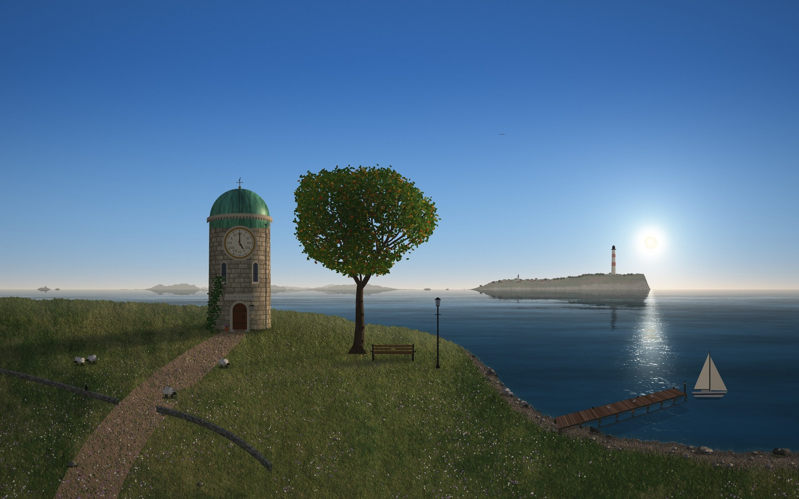
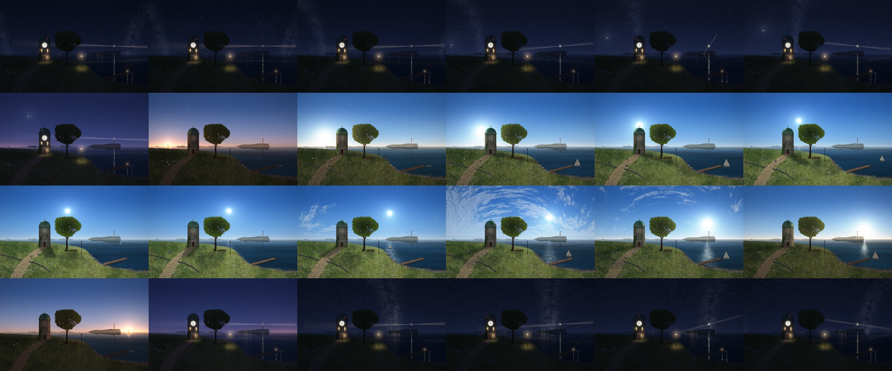
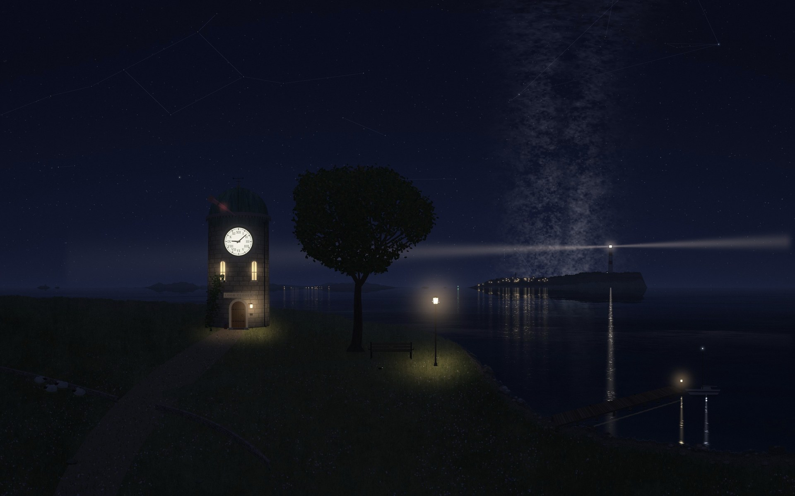

# The Listening Point

A macOS wallpaper that is a window onto one place, a frame for every minute of the real day. The
sun, moon, planets and stars stand where they actually are over Budapest at that minute; the clouds,
rain, fog and snow follow the morning's forecast; the tree leafs, turns and goes bare with the
seasons; and the tower clock tells the time to the minute.







## The scene

A small stone observatory on a headland above a bay, with a tree, a bench for two, a lamp, a pier,
and a lighthouse across the water. Claude designed it as a self-portrait of sorts. There's a bench
for two because most of what it does is conversation. The observatory and the real stars stand for
curiosity and getting things right. The lighthouse is a light kept on for whoever needs it. And
"LOOK CLOSER" is carved over the door, because the scene rewards it.

### What follows the real world

- **Time.** The tower clock shows the hour and minute; it glows after dusk.
- **Sky.** Sun, moon (with its real phase and tilt), the bright planets, about 9,700 stars and the
  Milky Way, for 47.5° N in local clock time, daylight saving included. So the sun rises at 04:46 in
  June and sets at 15:55 in December, behind the headland in winter and into the open sea in spring
  and autumn. Meteors follow the real showers.
- **Weather.** The hourly forecast from [Open-Meteo](https://open-meteo.com) drives three cloud layers
  (cirrus, mid-level fleece, low cloud or overcast), rain, drizzle, snow, fog, thunderstorms, wind
  (waves, whitecaps, the weathervane), wet ground, lying snow and frost. Clouds drift with the wind,
  and when one crosses the sun the light dims. Sun and showers together make a rainbow.
- **Seasons.** The tree leafs out in April and turns and drops its leaves through October and
  November; grass, wildflowers and the fields across the bay change with the months; there are lambs
  in spring, shorn sheep in early summer, fireflies in June and July, and bats from spring to autumn.
- **Tide.** It rises and falls with the moon, springs and neaps included, over the shingle beach.
- **Life.** The boat goes out on fair days in the sailing season. Sheep wander and fold at dusk;
  a black cat keeps its own routine; gulls come and go on the pier; ships pass on the horizon; a heron
  fishes at dawn, rabbits come out at dusk, an owl sits in the tree some nights. The village across
  the bay goes to bed one window at a time.
- **The observatory.** On clear nights the dome opens and the telescope follows the moon, a planet
  or a bright star. On cloudy nights the observer goes to bed.

There are also things that happen rarely, and things nobody can explain. They're listed in
[docs/SPOILERS.md](docs/SPOILERS.md) for whoever would rather not find them.

## How it runs

macOS dynamic wallpapers can switch every minute, but the wallpaper agent saves every frame it shows
as an uncompressed bitmap of about 20 MB and never deletes them, so 1,440 frames a day would fill
the disk. Instead:

- **Frames.** A background job renders frames whenever the Mac is awake, at low priority. On power
  it renders the rest of today and all of tomorrow (1,440 frames, about 1 GB, about 40 minutes with
  two processes); on battery, the next three hours at a time. It keeps yesterday, today and tomorrow.
- **The live window.** A small helper (`tools/live_wallpaper.swift`) shows the frame for the current
  minute in a window just above the desktop picture and below the desktop icons, on every Space and
  display, cross-fading on the minute. It uses about 20-40 MB and no measurable CPU. After sleep it
  starts the render job if today's frames are missing.
- **The system wallpaper** is an hourly dynamic HEIC of the same day, so the lock screen, Mission
  Control and the moment of a Space switch (when macOS draws the system wallpaper, not the helper)
  show the right hour. It's rebuilt daily if the helper has Full Disk Access, which it uses only to
  delete the wallpaper agent's old bitmaps of our own files; otherwise monthly, and
  `tools/clean_wallpaper_cache.py` (run from Terminal) clears what builds up.

No AI is involved after installation: everything is computed from the date by the code here, and the
only network request is the weather forecast (Budapest's coordinates only).

## Install

Requires macOS 14 or later, Python 3.9+ (the Xcode Command Line Tools' is fine) and Swift.

```sh
./build.sh --install       # copies the renderer to ~/Library/Application Support/The Listening Point,
                           # starts the helper and the render job, and sets the hourly wallpaper
tools/uninstall.sh         # removes the helper and the render job
```

The installed copy runs from Application Support because launchd jobs may not read `~/Documents`.
Re-run `tools/install.sh` after changing the renderer. The log is `~/Library/Logs/listening-point.log`.

Optional: System Settings > Privacy & Security > Full Disk Access > add
`~/Library/Application Support/The Listening Point/live_wallpaper`, so the lock-screen wallpaper
follows each day's weather (see above).

## Build

```sh
./build.sh                       # today's 1,440 frames into out/days/<date>, plus an hourly HEIC
DATE=2026-12-21 ./build.sh       # another day (forecast up to ~2 weeks ahead, made-up weather past that)
SCALE=0.25 EVERY=60 ./build.sh   # quick preview: one frame an hour, see out/days/<date>/sheet.jpg
WEATHER=fair ./build.sh          # fair weather (also: synthetic, offline)
```

The hourly HEIC (`out/The Listening Point <date>.heic`) works as an ordinary dynamic wallpaper on any
Mac, without the helper: it changes on the hour.

## How it's made

- **No 3D engine and no image model.** Everything is hand-written 2D procedural rendering on the CPU
  with NumPy, SciPy and Pillow, split by subject in `renderers/procedural/` (`sky`, `sea`, `land`,
  `tree`, `tower`, `props`, `life`, `distant`, `weatherfx`, `mystery`).
- **Astronomy** (`astro.py`): sun, moon (full ELP-2000/82 series), planets (truncated VSOP87) and
  precessed stars, matching JPL's DE421 to better than 0.01° (`tests/test_astro.py`).
- **Weather** (`weather.py`): Open-Meteo's hourly forecast interpolated to minutes, with derived
  wetness, lying snow and frost; offline it falls back to the cache, then to made-up weather with a
  Budapest-like climate (`tests/test_weather.py`).
- **A day** (`day.py`, `season.py`, `events.py`): one date's per-minute astronomy, weather, season
  and schedule, decided by the date so a day always renders the same way.
- **Per-minute frames, cheaply.** The near scenery (grass, tree, pier) changes only with the light,
  so it is rendered every 10 minutes (in sunlit and shaded versions when clouds are about) and
  cross-faded; the sky, sea, clouds, creatures and weather are rendered every minute.
- **The pier** is modelled in 3D and projected through the same camera as the sea.

## Layout

```
renderers/procedural/       the renderer (listening_point.py is the entry point)
tools/install.sh            install the live wallpaper; uninstall.sh removes it
tools/nightly.py            the render job launchd runs every 15 minutes
tools/clean_wallpaper_cache.py  clear the wallpaper agent's stale bitmaps (from Terminal)
tools/live_wallpaper.swift  the helper window that shows the current minute
tools/make_h24.swift        pack frames into a time-of-day HEIC
tools/set_wallpaper.py      set a picture on every Space
tools/capture_wallpaper.sh  screenshot what the desktop is showing
tests/                      astronomy and weather tests (offline)
docs/                       preview images, and the spoilers
STATUS.md                   current state, decisions, macOS lessons, next ideas
```

## License

MIT; see [LICENSE](LICENSE). This covers the code and the rendered images. Weather data from
Open-Meteo (CC BY 4.0).
